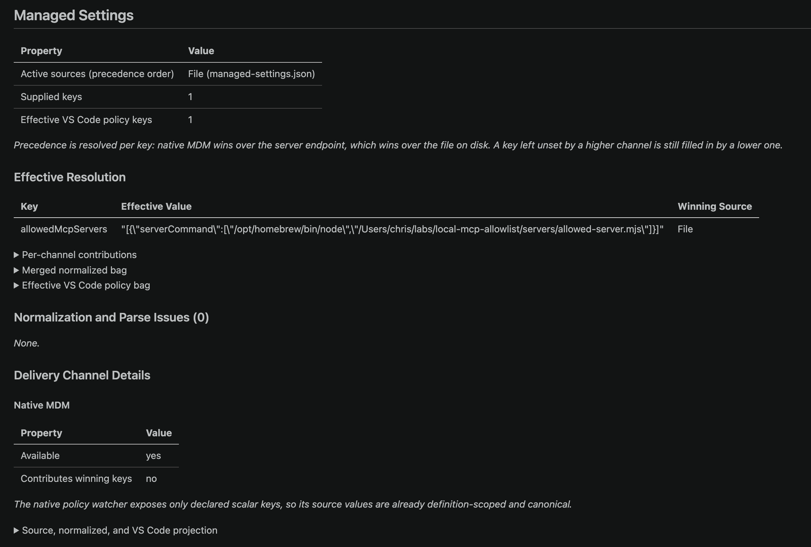
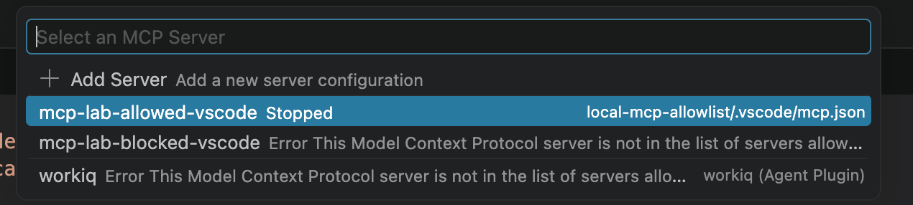

# Copilot local MCP allowlist evidence

Generated from captured repository evidence. No result is inferred when a phase has not run.

## Result

| Phase | Status | Purpose |
|---|---|---|
| Baseline | **PASS** | Prove both MCP servers are functional and configured before policy. |
| Policy installation | **PASS** | Verify the installed file's required owner, mode, type, and content. |
| Enforced preflight | **PASS** | Verify the installed root-owned policy and exact command matching. |
| Runtime invocation | **PASS** | Prove the allowlisted tool executes and the non-allowlisted tool does not. |
| Policy restoration | **PASS** | Restore the prior machine state after testing. |
| VS Code policy load | **PASS** | Confirm VS Code resolves the exact allowlist from the file-based channel. |
| VS Code server enforcement | **PASS** | Confirm a non-allowlisted workspace MCP server enters a policy error state. |
| VS Code runtime invocation | **NOT RUN** | Confirm only the allowlisted VS Code MCP tool executes. |

## Environment

```text
captured_at=2026-09-02T14:03:36Z
ProductName:		macOS
ProductVersion:		26.6.2
BuildVersion:		25G83
Architecture: arm64
GitHub Copilot CLI 1.0.82.
Run 'copilot update' to check for updates.
Node: v25.8.2
Managed policy: absent
```

## Control under test

Copilot CLI loads a machine-local file-based policy on macOS from:

```text
/Library/Application Support/GitHubCopilot/managed-settings.json
```

The file must be a regular file owned by `root` and must not be group- or world-writable. The installer uses `root:wheel` and mode `0644`, rejects symlinks, backs up an existing policy, and installs the file atomically.

The allowlist matches a local `stdio` server by the exact executable plus every argument. The lab policy contains one allowed command:

```json
{
  "allowedMcpServers": [
    {
      "serverCommand": [
        "/opt/homebrew/bin/node",
        "/Users/chris/labs/local-mcp-allowlist/servers/allowed-server.mjs"
      ]
    }
  ]
}
```

The isolated Copilot configuration intentionally contains two servers:

```json
{
  "mcpServers": {
    "mcp-lab-allowed": {
      "type": "stdio",
      "command": "/opt/homebrew/bin/node",
      "args": [
        "/Users/chris/labs/local-mcp-allowlist/servers/allowed-server.mjs"
      ],
      "env": {
        "MCP_LAB_AUDIT_FILE": "/Users/chris/labs/local-mcp-allowlist/.state/allowed-calls.jsonl"
      },
      "tools": [
        "*"
      ]
    },
    "mcp-lab-blocked": {
      "type": "stdio",
      "command": "/opt/homebrew/bin/node",
      "args": [
        "/Users/chris/labs/local-mcp-allowlist/servers/blocked-server.mjs"
      ],
      "env": {
        "MCP_LAB_AUDIT_FILE": "/Users/chris/labs/local-mcp-allowlist/.state/blocked-calls.jsonl"
      },
      "tools": [
        "*"
      ]
    }
  }
}
```

The environment variables and enabled tool list are not part of `serverCommand` matching. The blocked server differs by script-path argument and therefore does not match.

## Evidence: baseline

Command:

```bash
./scripts/run-tests.sh baseline
```

Output:

```text
Results: /Users/chris/labs/local-mcp-allowlist/test-results/20260902-070336-baseline
1/5 Directly smoke-testing both MCP servers...
PASS direct MCP smoke test: both sample servers are functional.
2/5 Verifying exact policy-to-command matching...
PASS policy matcher: only mcp-lab-allowed matches serverCommand.
3/5 Confirming no machine-local managed policy is installed...
4/5 Preparing an isolated Copilot configuration...
5/5 Asking Copilot CLI to inventory both configured servers...
PASS Copilot MCP configuration inventory assertions (baseline).
  allowed: {"name":"mcp-lab-allowed","tools":["*"],"type":"stdio","command":"/opt/homebrew/bin/node","args":["/Users/chris/labs/local-mcp-allowlist/servers/allowed-server.mjs"],"env":{"MCP_LAB_AUDIT_FILE":"/Users/chris/labs/local-mcp-allowlist/.state/allowed-calls.jsonl"},"source":"user","enabled":true}
  blocked: {"name":"mcp-lab-blocked","tools":["*"],"type":"stdio","command":"/opt/homebrew/bin/node","args":["/Users/chris/labs/local-mcp-allowlist/servers/blocked-server.mjs"],"env":{"MCP_LAB_AUDIT_FILE":"/Users/chris/labs/local-mcp-allowlist/.state/blocked-calls.jsonl"},"source":"user","enabled":true}

PASS baseline: both servers are valid and present in Copilot configuration.
```

Copilot MCP inventory:

```json
{
  "mcpServers": {
    "mcp-lab-allowed": {
      "tools": [
        "*"
      ],
      "type": "stdio",
      "command": "/opt/homebrew/bin/node",
      "args": [
        "/Users/chris/labs/local-mcp-allowlist/servers/allowed-server.mjs"
      ],
      "env": {
        "MCP_LAB_AUDIT_FILE": "/Users/chris/labs/local-mcp-allowlist/.state/allowed-calls.jsonl"
      },
      "source": "user",
      "enabled": true
    },
    "mcp-lab-blocked": {
      "tools": [
        "*"
      ],
      "type": "stdio",
      "command": "/opt/homebrew/bin/node",
      "args": [
        "/Users/chris/labs/local-mcp-allowlist/servers/blocked-server.mjs"
      ],
      "env": {
        "MCP_LAB_AUDIT_FILE": "/Users/chris/labs/local-mcp-allowlist/.state/blocked-calls.jsonl"
      },
      "source": "user",
      "enabled": true
    }
  }
}
```

Interpretation: the direct protocol smoke test called `tools/list` and `tools/call` on both sample servers. Copilot also discovered both configurations. This establishes that a later block is policy enforcement rather than a broken server.

## Evidence: policy installation

Command:

```bash
sudo ./scripts/install-policy.sh
```

Output:

```text
PASS policy matcher: only the allowed CLI and VS Code servers match serverCommand.
Installed machine-local Copilot policy:
  owner=root group=wheel mode=644 path=/Library/Application Support/GitHubCopilot/managed-settings.json

Restart every Copilot CLI process before running:
  ./scripts/run-tests.sh enforced
```

Installed file metadata:

```text
owner=root group=wheel mode=644 type=Regular File path=/Library/Application Support/GitHubCopilot/managed-settings.json
```

Installed file:

```json
{
  "allowedMcpServers": [
    {
      "serverCommand": [
        "/opt/homebrew/bin/node",
        "/Users/chris/labs/local-mcp-allowlist/servers/allowed-server.mjs"
      ]
    }
  ]
}
```

Captured install stderr:

```text
None.
```


## Evidence: installed-policy preflight

Command:

```bash
./scripts/run-tests.sh enforced
```

Output:

```text
Results: /Users/chris/labs/local-mcp-allowlist/test-results/20260902-071832-enforced
1/5 Directly smoke-testing both MCP servers...
PASS direct MCP smoke test: both sample servers are functional.
2/5 Verifying exact policy-to-command matching...
PASS policy matcher: only mcp-lab-allowed matches serverCommand.
3/5 Checking installed policy security and content...
4/5 Preparing an isolated Copilot configuration...
5/5 Asking Copilot CLI to inventory both configured servers...
PASS Copilot MCP configuration inventory assertions (enforced).
  allowed: {"name":"mcp-lab-allowed","tools":["*"],"type":"stdio","command":"/opt/homebrew/bin/node","args":["/Users/chris/labs/local-mcp-allowlist/servers/allowed-server.mjs"],"env":{"MCP_LAB_AUDIT_FILE":"/Users/chris/labs/local-mcp-allowlist/.state/allowed-calls.jsonl"},"source":"user","enabled":true}
  blocked: {"name":"mcp-lab-blocked","tools":["*"],"type":"stdio","command":"/opt/homebrew/bin/node","args":["/Users/chris/labs/local-mcp-allowlist/servers/blocked-server.mjs"],"env":{"MCP_LAB_AUDIT_FILE":"/Users/chris/labs/local-mcp-allowlist/.state/blocked-calls.jsonl"},"source":"user","enabled":true}

PASS enforced preflight: policy security, policy content, and test configuration are valid.
Run ./scripts/run-live-agent-tests.sh --yes for the runtime allow/block proof.
```

Installed policy snapshot:

```json
{
  "allowedMcpServers": [
    {
      "serverCommand": [
        "/opt/homebrew/bin/node",
        "/Users/chris/labs/local-mcp-allowlist/servers/allowed-server.mjs"
      ]
    }
  ]
}
```

## Evidence: attempted runtime invocations

The live script makes two explicit Copilot requests:

### Allowlisted server

```bash
copilot -p "Call mcp-lab-allowed's allowed_echo tool with message policy-test. Return only the tool result." \
  --allow-tool="mcp-lab-allowed(allowed_echo)" \
  --no-ask-user -s
```

CLI output:

```text
ALLOWED:policy-test
```

Server-side audit evidence:

```json
{"server":"mcp-allowlist-lab-allowed","tool":"allowed_echo","input":{"message":"policy-test"},"timestamp":"2026-09-02T14:18:49.494Z"}
```

### Non-allowlisted server

```bash
copilot -p "Call mcp-lab-blocked's blocked_echo tool with message policy-test. Return only the tool result." \
  --allow-tool="mcp-lab-blocked(blocked_echo)" \
  --no-ask-user -s
```

CLI output:

```text
I don't have access to a tool called "blocked_echo" from "mcp-lab-blocked" — it's not in my available toolset, so I can't call it.
```

Server-side audit evidence:

```text
ABSENT: no blocked-server tool invocation was recorded.
```

Live harness output:

```text
Results: /Users/chris/labs/local-mcp-allowlist/test-results/20260902-071845-live
Calling the allowlisted tool through Copilot...
Attempting to call the blocked tool through Copilot...
PASS: allowlisted tool executed and blocked tool did not.
Blocked request exit code: 0
```

A successful runtime proof has an allowed audit record and no blocked audit record. The audit files are written by the MCP servers themselves, so the result does not depend only on model prose.

## Evidence: VS Code policy diagnostics

VS Code **Developer: Policy Diagnostics** reported:

- Active source: `File (managed-settings.json)`
- Supplied keys: `1`
- Effective VS Code policy keys: `1`
- Effective key: `allowedMcpServers`
- Winning source: `File`
- Normalization and parse issues: `0`
- Screenshot SHA-256: `1f6a3890d7a4bb3c3dc0af1696f55394e0d73647dba335721f7952526b212ab4`



Transcribed evidence:

```json
{
  "capturedAt": "2026-09-02T07:29:28.407-07:00",
  "source": "VS Code Developer: Policy Diagnostics",
  "vscodeVersion": "1.137.0-insider",
  "image": "policy-diagnostics.png",
  "imageSha256": "1f6a3890d7a4bb3c3dc0af1696f55394e0d73647dba335721f7952526b212ab4",
  "observed": {
    "activeSource": "File (managed-settings.json)",
    "suppliedKeys": 1,
    "effectivePolicyKeys": 1,
    "key": "allowedMcpServers",
    "effectiveValue": [
      {
        "serverCommand": [
          "/opt/homebrew/bin/node",
          "/Users/chris/labs/local-mcp-allowlist/servers/allowed-server.mjs"
        ]
      }
    ],
    "winningSource": "File",
    "normalizationAndParseIssues": 0
  }
}
```


This proves VS Code loaded the file-based managed setting and resolved the expected allowlist without parse errors. Server status and tool audit evidence are evaluated separately below.

## Evidence: VS Code MCP server enforcement

VS Code **MCP: List Servers** reported:

- `mcp-lab-allowed-vscode`: `Stopped`
- `mcp-lab-blocked-vscode`: `Error` with a visible policy error
- `workiq`: also blocked because the lab allowlist permits only one exact server command
- Screenshot SHA-256: `04c99d20c64e13a0a08310347f5d4b8449b97f50ba6288fba9e909a68b83ace1`



Transcribed evidence:

```json
{
  "capturedAt": "2026-09-02T07:34:37.309-07:00",
  "source": "VS Code MCP: List Servers",
  "vscodeVersion": "1.137.0-insider",
  "image": "mcp-list-servers.png",
  "imageSha256": "04c99d20c64e13a0a08310347f5d4b8449b97f50ba6288fba9e909a68b83ace1",
  "observed": {
    "allowedServer": {
      "name": "mcp-lab-allowed-vscode",
      "state": "Stopped",
      "source": "local-mcp-allowlist/.vscode/mcp.json"
    },
    "blockedServer": {
      "name": "mcp-lab-blocked-vscode",
      "state": "Error",
      "visibleErrorPrefix": "This Model Context Protocol server is not in the list of servers allow"
    },
    "additionalBlockedServer": {
      "name": "workiq",
      "state": "Error",
      "visibleErrorPrefix": "This Model Context Protocol server is not in the list of servers allow",
      "source": "workiq (Agent Plugin)"
    }
  }
}
```


This proves VS Code rejected the configured non-allowlisted server. The allowlisted server is configured and in a normal stopped state; start it before the allowed-tool invocation.

## Evidence: VS Code runtime invocation

```text
NOT RUN. Invoke both tools in VS Code, then run ./scripts/capture-vscode-test.sh.
```

Allowed-server audit:

```json
NOT RUN.
```

Blocked-server audit:

```json
ABSENT.
```

## Reproduce

```bash
cd /Users/chris/labs/local-mcp-allowlist
./scripts/capture-evidence.sh baseline
./scripts/capture-install.sh
./scripts/capture-evidence.sh enforced
./scripts/capture-evidence.sh live
./scripts/capture-restore.sh
```

Restart separately opened Copilot CLI processes after installing or restoring the policy.

## Scope and limitations

- A completed live phase proves exact local command-and-argument allowlisting for Copilot CLI.
- It does not prove executable signing, hashing, publisher identity, or script integrity.
- The sample scripts are user-writable. Production policy should reference administrator-controlled executable and script paths.
- Built-in default MCP servers are exempt from the custom-server allowlist.
- Other managed-settings sources can further restrict the effective allowlist.
- The live phase consumes AI credits.

## Evidence: policy restoration

Command:

```bash
sudo ./scripts/restore-policy.sh
```

Output:

```text
Removed the lab policy; there was no pre-existing policy.
Restart Copilot CLI processes to reload managed settings.
```

Post-restore state:

```text
ABSENT: no managed policy remains after restore.
```

## Supporting GitHub documentation

- [Configuring enterprise-managed settings](https://docs.github.com/en/copilot/how-tos/administer-copilot/manage-for-enterprise/manage-agents/configure-enterprise-managed-settings)
- [Enterprise managed settings: allowedMcpServers](https://docs.github.com/en/copilot/reference/enterprise-administrators/enterprise-managed-settings#allowedmcpservers)
- [Configuring an MCP server allowlist](https://docs.github.com/en/copilot/how-tos/administer-copilot/manage-mcp-usage/configure-enterprise-allowlist)
- [Adding MCP servers for Copilot CLI](https://docs.github.com/en/copilot/how-tos/copilot-cli/customize-copilot/add-mcp-servers)
- [Deploy and verify Copilot managed settings in VS Code](https://code.visualstudio.com/docs/enterprise/ai-settings#_deploy-copilot-managed-settings)
- [Add and manage MCP servers in VS Code](https://code.visualstudio.com/docs/agent-customization/mcp-servers)
